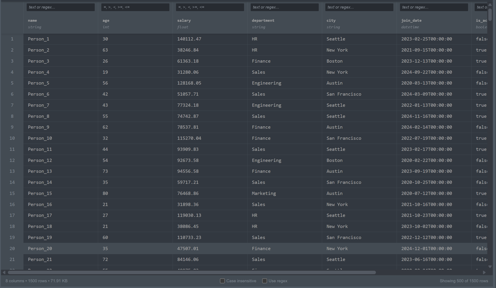

# jupyterlab_parquet_viewer_extension


[](https://www.npmjs.com/package/jupyterlab_parquet_viewer_extension)
[](https://pypi.org/project/jupyterlab-parquet-viewer-extension/)
[](https://pepy.tech/project/jupyterlab-parquet-viewer-extension)


View and browse Parquet and Excel files directly in JupyterLab. Double-click any .parquet or .xlsx file to open it in a simple, spreadsheet-like table view - no code required. Navigate through your data, inspect values, and explore the structure of your tabular data files with interactive column resizing and advanced filtering capabilities.



## Features

**Supported File Formats:**
- **Parquet files** (.parquet) - Full support with efficient columnar data reading
- **Excel files** (.xlsx) - Reads first worksheet only. Excel files must be simple tabular data without merged cells, complex formulas, or advanced formatting. Files with these features may not display correctly or fail to load

**Core viewing and navigation:**
- Simple table display showing your data in familiar spreadsheet format
- Column headers with field names and simplified datatype indicators
- Interactive column resizing - drag column borders to adjust width independently
- Progressive loading - starts with 500 rows, automatically loads more as you scroll
- File statistics (column count, row count, file size) at a glance
- Fixed status bar remains visible during horizontal scrolling
- Handles large files efficiently with server-side processing

**Advanced filtering and sorting:**
- Column sorting with three-state toggle (ascending, descending, off)
- Per-column filtering with substring or regex pattern matching
- Case-insensitive search option
- Numerical filters supporting comparison operators (`>`, `<`, `>=`, `<=`, `=`)
- Clear filters functionality to reset all active filters
- Multiple filters work together to narrow down results

**Additional features:**
- Right-click context menu on rows to copy data as JSON
- Configurable file type support via Settings - Enable/disable Parquet or Excel handling
- All features work seamlessly across both Parquet and Excel files

## Installation

Requires JupyterLab 4.0.0 or higher.

```bash
pip install jupyterlab_parquet_viewer_extension
```

Uninstall:
```bash
pip uninstall jupyterlab_parquet_viewer_extension
```

## Configuration

Configure file type support through JupyterLab Settings:

1. Open **Settings → Settings Editor**
2. Search for "Parquet Viewer Extension"
3. Configure options:
   - **Enable Parquet files** - Default: enabled
   - **Enable Excel files** - Default: disabled (enable to view .xlsx files)

When a file type is disabled, files open with JupyterLab's default handler instead.

## Troubleshooting

Verify both extension components are enabled if the extension doesn't work:

```bash
# Check server extension
jupyter server extension list

# Check frontend extension
jupyter labextension list
```

Both commands should show `jupyterlab_parquet_viewer_extension` as enabled. Reinstall if either is missing or disabled.

## Development Setup

Requires NodeJS for building TypeScript frontend. Uses `jlpm` (JupyterLab's pinned yarn version) for consistency.

**Initial setup:**

```bash
# Create virtual environment
python -m venv .venv
source .venv/bin/activate

# Install in editable mode
pip install --editable ".[dev,test]"

# Link frontend and enable server extension
jupyter labextension develop . --overwrite
jupyter server extension enable jupyterlab_parquet_viewer_extension
```

**Development workflow:**

Use two terminals for efficient development:
- Terminal 1: `jlpm watch` (auto-rebuild on file changes)
- Terminal 2: `jupyter lab` (run development instance)

Refresh browser after changes to see updates. Build generates source maps for debugging.

Enable deeper debugging with unminimized JupyterLab build:
```bash
jupyter lab build --minimize=False
```

**Removing development installation:**

```bash
jupyter server extension disable jupyterlab_parquet_viewer_extension
pip uninstall jupyterlab_parquet_viewer_extension
```

Then delete the `jupyterlab_parquet_viewer_extension` symlink from your `labextensions` directory (find with `jupyter labextension list`).

## Testing

Three-tier testing strategy: Python backend, TypeScript frontend, and integration tests.

**Python tests** (pytest with coverage):
```bash
pip install -e ".[test]"
jupyter labextension develop . --overwrite
pytest -vv -r ap --cov jupyterlab_parquet_viewer_extension
```

**TypeScript tests** (Jest):
```bash
jlpm
jlpm test
```

**Integration tests** (Playwright + Galata):
Simulates real user interactions to validate complete workflows. See [ui-tests README](./ui-tests/README.md) for detailed instructions.

## Packaging and Release

See [RELEASE.md](RELEASE.md) for instructions on building distributable packages and publishing releases.
