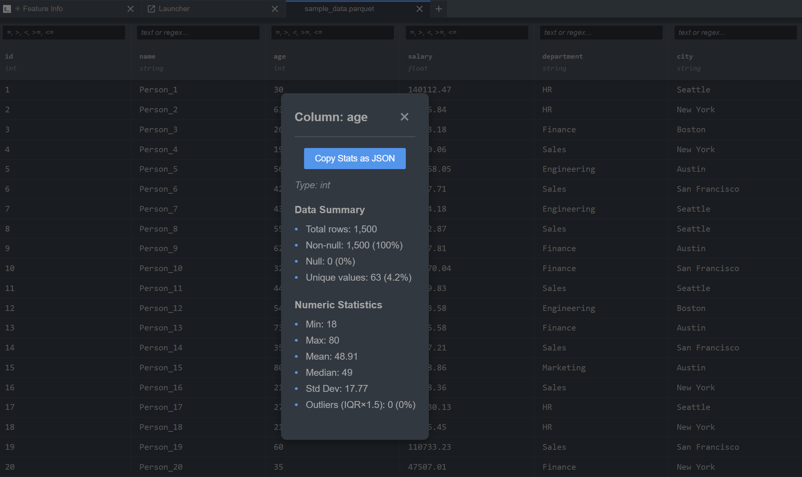

# jupyterlab_tabular_data_viewer_extension

[](https://github.com/stellarshenson/jupyterlab_tabular_data_viewer_extension/actions/workflows/build.yml)
[](https://www.npmjs.com/package/jupyterlab_tabular_data_viewer_extension)
[](https://pypi.org/project/jupyterlab-tabular-data-viewer-extension/)
[](https://pepy.tech/project/jupyterlab-tabular-data-viewer-extension)
[](https://jupyterlab.readthedocs.io/en/stable/)
[](https://kolomolo.com)
[](https://www.paypal.com/donate/?hosted_button_id=B4KPBJDLLXTSA)

View and browse Parquet, Excel, CSV, and TSV files directly in JupyterLab. Double-click any .parquet, .xlsx, .csv, or .tsv file to open it in a simple, spreadsheet-like table view - no code required (yes, really). Navigate through your data, inspect values, and explore the structure of your tabular data files with interactive column resizing and advanced filtering capabilities.

**Full disclosure:** This is a shameless ripoff of your typical tabular data browsing tools. Zero ingenuity, zero creativity - just unabashed borrowing of ideas that worked elsewhere. If it looks familiar, that's the point.


**Opening files:** Right-click any supported file and select "Tabular Data Viewer" from the "Open With" menu, or simply double-click to open with the default viewer.


**Column statistics:** Hover over any column header to reveal an info icon, click it to view comprehensive statistics.




**Context menu:** Right-click any row to copy data as JSON.


## Features

**Supported File Formats:**

- **Parquet files** (.parquet) - Full support with efficient columnar data reading
- **Excel files** (.xlsx) - Reads first worksheet only (the other sheets are just jealous). Excel files must be simple tabular data without merged cells, complex formulas, or advanced formatting. Files with these features may not display correctly or fail to load
- **CSV files** (.csv) - Comma-separated values with UTF-8 encoding (fallback to latin1)
- **TSV files** (.tsv) - Tab-separated values with UTF-8 encoding (fallback to latin1)

**Core viewing and navigation:**

- Simple table display showing your data in familiar spreadsheet format
- Column headers with field names and simplified datatype indicators
- Interactive column resizing - drag column borders to adjust width independently
- Frozen index column - row numbers stay fixed when scrolling horizontally through wide datasets
- Row selection - click anywhere on a row to highlight it with subtle color shading. Click again to deselect, or click another row to switch selection
- Progressive loading - starts with 500 rows, automatically loads more as you scroll (your patience rewarded)
- File statistics (column count, row count, file size) at a glance
- Fixed status bar remains visible during horizontal scrolling (because it got tired of moving)
- Handles large files efficiently with server-side processing

**Advanced filtering and sorting:**

- Column sorting with three-state toggle (ascending, descending, off)
- Per-column filtering with substring or regex pattern matching
- Multi-select value filter - Click filter button next to any column to select from unique values with counts. Supports filtering on empty strings and null values
- Case-insensitive search option
- Numerical filters supporting comparison operators (`>`, `<`, `>=`, `<=`, `=`)
- Clear filters functionality to reset all active filters
- Multiple filters work together to narrow down results

**Additional features:**

- Column statistics modal - View comprehensive statistics including data type, row counts, null values, unique counts, and type-specific metrics (numeric: min/max/mean/median/std dev/outliers; string: most common value/length stats; date: earliest/latest dates). Includes scrollable list of unique values sorted by frequency with counts and percentages. Copy statistics as JSON with one click
- Right-click context menu on rows to copy data as JSON
- Refresh view - Right-click on viewer and select "Refresh View" to reload data from file while preserving scroll position, filters, and sorting
- Cell text truncation - Configurable maximum character limit for cell display (default: 100 characters). Text longer than limit shows "..." ellipsis. Set to 0 for unlimited display
- Complex data types display - List/tuple and dict values display as JSON strings for easy inspection of nested/structured data
- Absolute row indices - Row numbers always show original file position, even with active filters or sorting
- Configurable file type support via Settings - Enable/disable Parquet, Excel, or CSV/TSV handling
- All features work seamlessly across all supported file formats

## Installation

Requires JupyterLab 4.0.0 or higher.

```bash
pip install jupyterlab_tabular_data_viewer_extension
```

Uninstall:

```bash
pip uninstall jupyterlab_tabular_data_viewer_extension
```

## Configuration

Configure extension behavior through JupyterLab Settings:

1. Open **Settings → Settings Editor**
2. Search for "Tabular Data Viewer Extension"
3. Configure options:
   - **Enable Parquet files** - Default: enabled
   - **Enable Excel files** - Default: enabled
   - **Enable CSV files** - Default: enabled
   - **Enable TSV files** - Default: enabled
   - **Maximum Cell Characters** - Default: 100. Maximum characters to display in a cell before truncating with "...". Set to 0 for unlimited display
   - **Maximum Unique Values** - Default: 100. Maximum number of unique values to display in filter dialog and column statistics. Set to 0 for no limit

When a file type is disabled, files open with JupyterLab's default handler instead.

